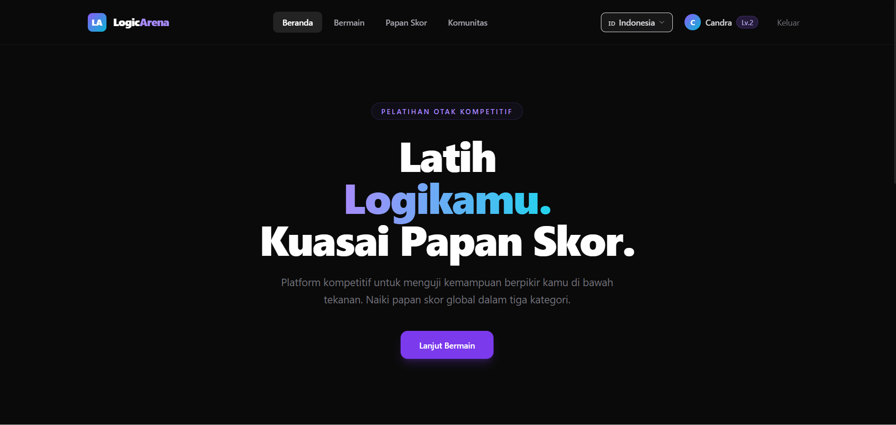
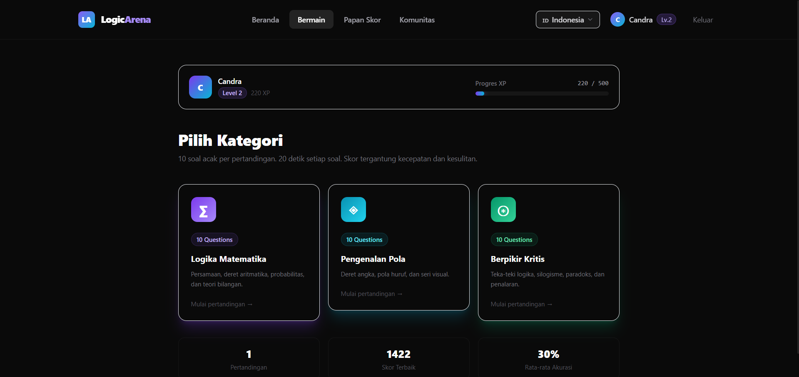
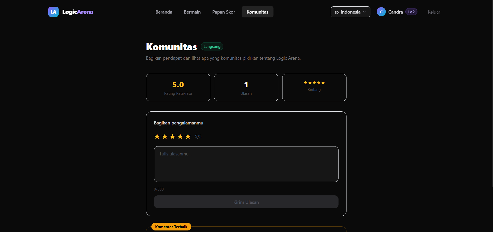
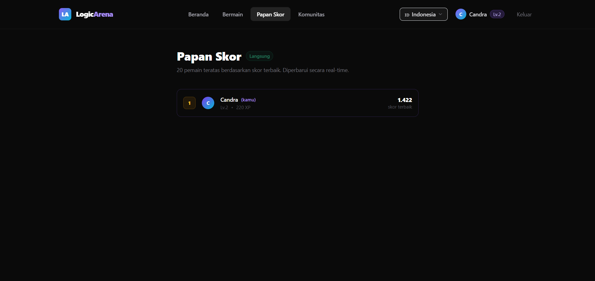

# Logic Arena

<p align="center">
  
</p>

<p align="center">
  <a href="https://logic-id.web.app"><strong>🌐 Live Demo → logic-id.web.app</strong></a>
</p>

<p align="center">
  
  
  
  
  
</p>

---

Game otak kompetitif berbasis React + Firebase. Uji logika, pengenalan pola, dan berpikir kritis dengan tekanan waktu. Bersaing di papan skor global secara real-time.

---

## Screenshots

<p align="center">
  
</p>
<p align="center">
  
</p>
<p align="center">
  
<p align="center">
  
</p>

---

## Fitur

- **Autentikasi** — Login dengan Email/Password dan Google
- **3 Kategori Soal** — Logika Matematika, Pengenalan Pola, Berpikir Kritis
- **10 Soal per Pertandingan** — Timer 20 detik per soal
- **Sistem Skor** — Poin berdasarkan kecepatan + tingkat kesulitan
- **XP & Level** — 10 level dengan progress bar animasi
- **Papan Skor Global** — Real-time via Firestore
- **Riwayat Pertandingan** — Histori 20 match terakhir
- **Komunitas** — Feedback dengan rating bintang dan likes
- **Multi-bahasa** — Indonesia 🇮🇩, English 🇺🇸, Español 🇪🇸

---

## Teknologi

| Teknologi | Kegunaan |
|---|---|
| React 18 | UI framework |
| Vite 5 | Build tool |
| Tailwind CSS 3 | Styling |
| Framer Motion | Animasi |
| Firebase Auth | Autentikasi |
| Cloud Firestore | Database real-time |
| Firebase Hosting | Deployment |
| GitHub Actions | CI/CD otomatis |

---

## Menjalankan Project

### Prasyarat

- Node.js >= 18
- npm >= 8
- Akun Firebase

### Instalasi

```bash
# 1. Clone repository
git clone https://github.com/candra2006/logic-arena.git
cd logic-arena

# 2. Install dependencies
npm install

# 3. Setup environment variables
cp .env.example .env
# Edit .env dan isi dengan Firebase config kamu

# 4. Jalankan dev server
npm run dev
```

Buka `http://localhost:5173` di browser.

---

## Setup Firebase

### 1. Buat Firebase Project

Buka [Firebase Console](https://console.firebase.google.com) → **Add project** → ikuti langkah-langkahnya.

### 2. Aktifkan Authentication

Firebase Console → **Authentication** → **Sign-in method** → aktifkan:
- Email/Password
- Google

### 3. Buat Firestore Database

Firebase Console → **Firestore Database** → **Create database** → pilih **production mode**.

### 4. Deploy Firestore Rules

```bash
# Install Firebase CLI (jika belum)
npm install -g firebase-tools

# Login
firebase login

# Deploy rules dan indexes
firebase deploy --only firestore
```

Atau copy-paste isi `firestore.rules` ke tab **Rules** di Firestore Console secara manual.

### 5. Ambil Firebase Config

Firebase Console → **Project Settings** → **Your Apps** → **SDK setup and configuration** → pilih **Config**.

---

## Environment Variables

Buat file `.env` dari `.env.example`:

```bash
cp .env.example .env
```

Isi dengan config Firebase project kamu:

```env
VITE_FIREBASE_API_KEY=your_api_key
VITE_FIREBASE_AUTH_DOMAIN=your_project.firebaseapp.com
VITE_FIREBASE_PROJECT_ID=your_project_id
VITE_FIREBASE_STORAGE_BUCKET=your_project.appspot.com
VITE_FIREBASE_MESSAGING_SENDER_ID=your_sender_id
VITE_FIREBASE_APP_ID=your_app_id
```

> ⚠️ Jangan pernah commit file `.env` ke Git. File ini sudah ada di `.gitignore`.

---

## Struktur Project

```
logic-arena/
├── .github/
│   └── workflows/
│       ├── firebase-hosting-merge.yml      # Deploy otomatis saat push ke main
│       └── firebase-hosting-pull-request.yml  # Preview saat PR
├── docs/
│   └── screenshots/                        # Screenshot untuk README
├── public/
│   └── favicon.svg
├── src/
│   ├── components/
│   │   ├── CircularTimer.jsx
│   │   ├── CommentCard.jsx
│   │   ├── CommentForm.jsx
│   │   ├── LangSwitcher.jsx
│   │   ├── Navbar.jsx
│   │   ├── ProtectedRoute.jsx
│   │   └── XPBar.jsx
│   ├── context/
│   │   ├── AuthContext.jsx
│   │   └── LangContext.jsx
│   ├── data/
│   │   ├── criticalThinking.js
│   │   ├── mathLogic.js
│   │   └── patterns.js
│   ├── hooks/
│   │   ├── useFeedback.js
│   │   └── useMatchHistory.js
│   ├── pages/
│   │   ├── Community.jsx
│   │   ├── Game.jsx
│   │   ├── Home.jsx
│   │   ├── Leaderboard.jsx
│   │   ├── Login.jsx
│   │   ├── Play.jsx
│   │   ├── Profile.jsx
│   │   └── Register.jsx
│   ├── services/
│   │   ├── authService.js
│   │   ├── feedbackService.js
│   │   ├── firebase.js
│   │   └── gameService.js
│   ├── styles/
│   │   └── index.css
│   ├── App.jsx
│   └── main.jsx
├── .env.example
├── .gitignore
├── firebase.json
├── firestore.indexes.json
├── firestore.rules
├── index.html
├── package.json
├── postcss.config.js
├── tailwind.config.js
└── vite.config.js
```

---

## Deploy

### Otomatis (GitHub Actions)

Setiap push ke branch `main` akan otomatis men-deploy ke Firebase Hosting.

Pastikan secrets berikut sudah diset di GitHub repository:

```
Settings → Secrets and variables → Actions → New repository secret
```

| Secret | Cara mendapatkan |
|---|---|
| `FIREBASE_SERVICE_ACCOUNT_LOGIC_ID` | Firebase Console → Project Settings → Service accounts → Generate new private key |

### Manual

```bash
npm run build
firebase deploy
```

---

## Sistem Skor

| Kesulitan | Poin Dasar | Multiplier |
|---|---|---|
| Easy | 100 | 1x |
| Medium | 150 | 1.5x |
| Hard | 250 | 2.5x |

**Time Bonus:** +5 poin per detik tersisa

**Formula:** `(Base Points + Time Bonus) × Difficulty Multiplier`

---

## Sistem XP & Level

| Level | XP Dibutuhkan |
|---|---|
| 1 | 0 |
| 2 | 200 |
| 3 | 500 |
| 4 | 1,000 |
| 5 | 2,000 |
| 6 | 3,500 |
| 7 | 5,500 |
| 8 | 8,000 |
| 9 | 11,000 |
| 10 | 15,000 |

---

## Kontribusi

Pull request sangat disambut! Untuk perubahan besar, buka issue terlebih dahulu.

```bash
# Fork repo, lalu:
git checkout -b feature/nama-fitur
git commit -m "feat: tambah fitur baru"
git push origin feature/nama-fitur
# Buka Pull Request
```

## AUTHOR 
CANDRA 
